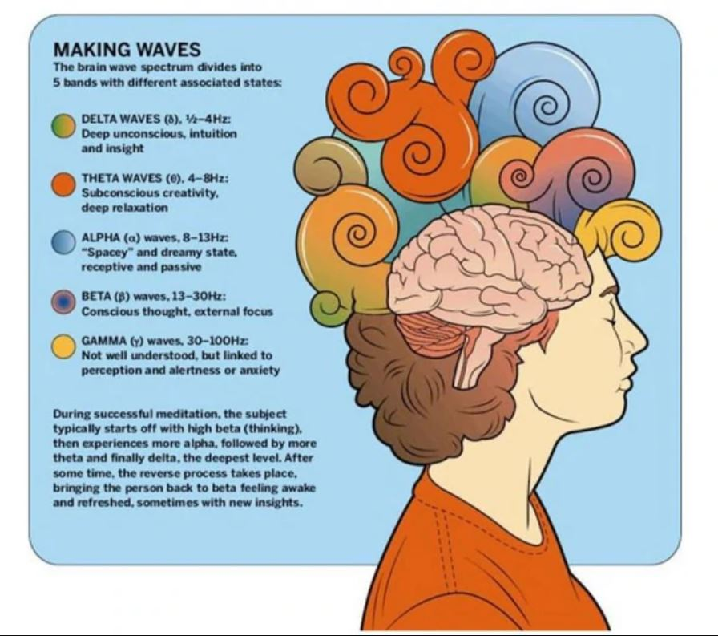
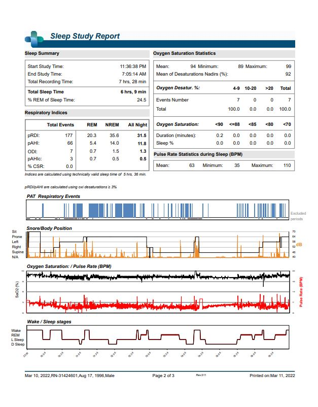
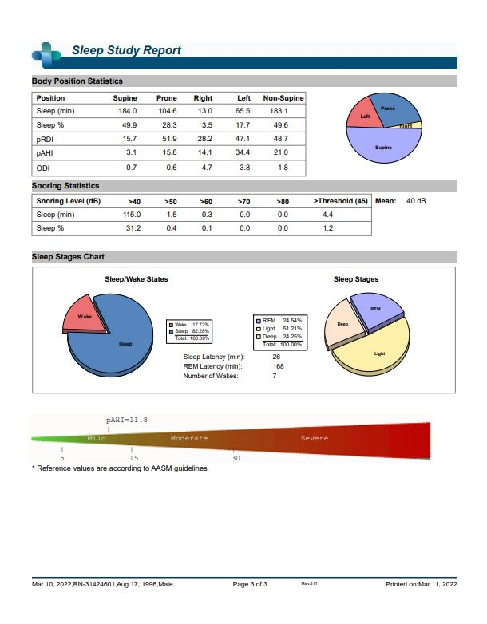

## Back-Story + Results

I was recommended to do a sleep study at the Straub Medical Center -Sleep Disorders Center of Pacific facility through my psychiatrist. The actual experiment was a one night experiment which required me to wear their equipment.

Here are the results:

The sleep itself was a lighter one then usual. I had trouble falling asleep which may have skewed the data a bit. Overall I was surprised to learn that I may have sleep apnea. Addressing sleep apnea can have benefits associated with mood and energy. I was also surprised to see that I sleep significantly in supine (back) position. This is because I always fall asleep and wake up on my side or prone (stomach). Unfortunately the study did not include the brain wave spectrum shown in the image at the top of this page.
***************************************************************************************
***************************************************************************************
