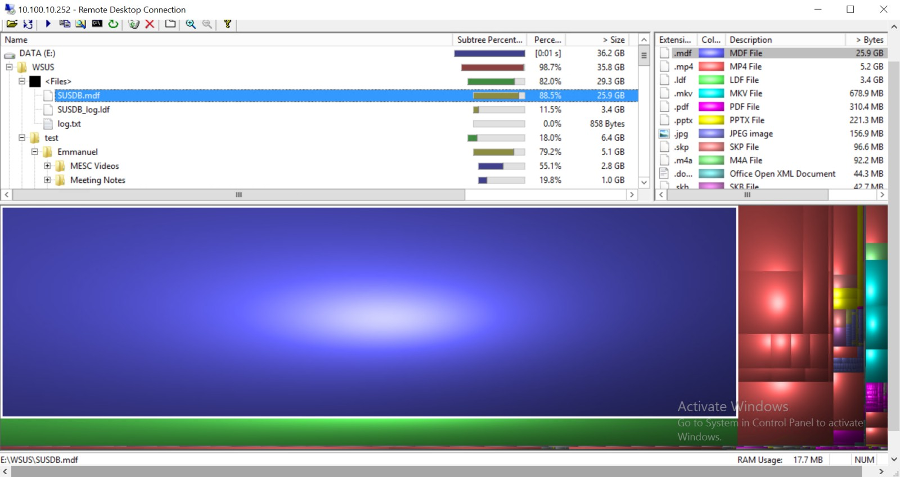
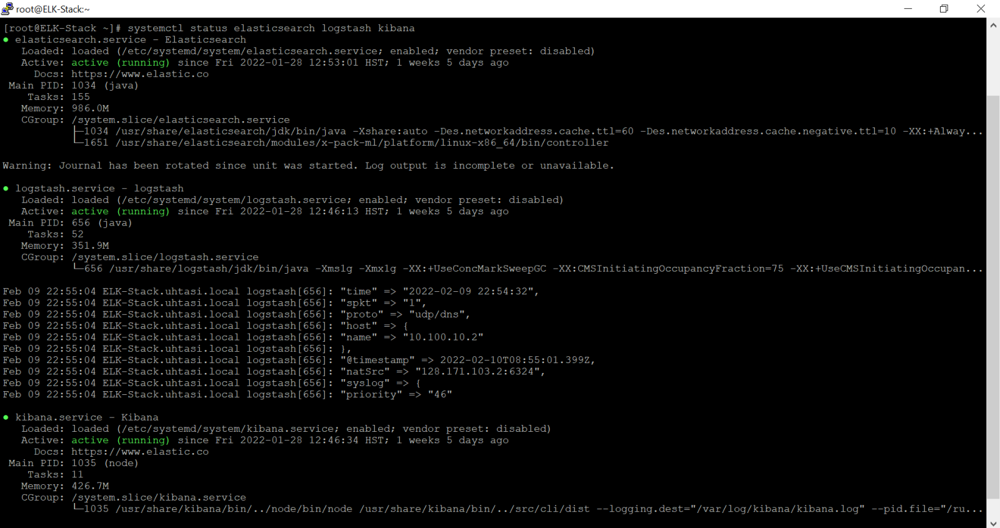
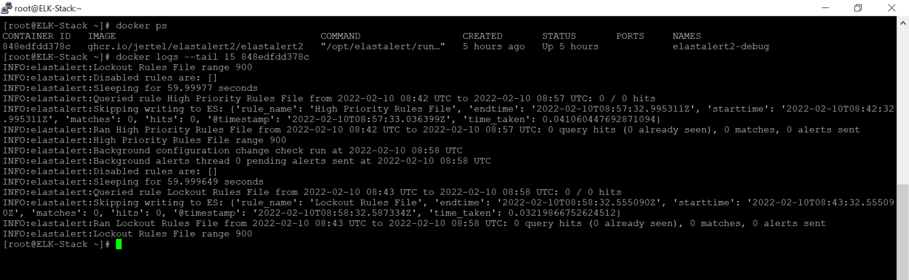

## INTRODUCTION:

I saw a job opening for the position of Systems Support Assistant at Telecommunications and Social Informatics Program (TASI) / Pacific Health Informatics Data Center (PHIDC) and I applied. I went through two interviews and ended up being chosen for the position. I am grateful to be working here simply for the fact that I learn so much. The classroom can only go so far, hands-on experience is invaluable. My position as Systems Support Assistant gave me experience with Linux, networking, scripting, disk partitioning, and virtual servers in sandboxed environments, among other things. If I did not work here, I would not have as much opportunity to sharpen my skills in these areas. It also gave me experience with IT tasks such as configuring the ELK Stack and the WSUS database. I look forward to working on more interesting projects with this organization. Here is some of what I did specifically:

## Windows Server Update Services (WSUS) :

*- - - - - - - - - - - - - - - - - - - - - Discovering the large SUSDB.mdf file with WinDirStat - - - - - - - - - - - - - -*

* Detached SUSDB.mdf database file from C drive and attached it to E drive using SQL Server Management Studio.
* Used PowerShell scripts to reduce bloated WSUS update count from 127,000 to 33,000 to 1600 (<2% of initial volume) and increased speed of WSUS software signficantly. Also eliminated random timeouts completely due to the mass of unneeded updates now being removed.
* Automated reporting through PowerShell scripts in Task Manager. Tabulated the updates based on attributes using HTML within PowerShell, then set the report to be auto-emailed to my supervisor on a weekly basis.
* Lastly, I created a technical [documentation]({{ site.baseurl }}/projects/notallowedtodistribute.pdf) of what I did with WSUS, as well as a PowerPoint version, and gave a presentation to my supervisor, the director, and the rest of the technical team.

## ELK Stack (Elasticsearch + Logstash + Kibana) :

*- - - - - - - - - - - - - - - - - - - - - Viewing the running statuses of the ELK services - - - - - - - - - - - - - - - - - -*

* Installed ELK Stack components on a CentOS VM and fit them in accordance to the organization's firewall.
* Ran the Logstash pipeline with a syslog configuration in order to receive and interpret logs from a syslog instance. Specifically, we wanted to search for SSLVPN logins, SSLVPN logouts, and rejected authentication attempts that were hitting the firewall.
* ~~Took it a step further to see RDP and SSH connections from a SSLVPN source IP.~~
* Created a custom grok filter to parse the syslog data for our specific use-case.
* Automated reporting by writing a bash script that receives a .csv from Kibana via a generated POST URL, waits for the .csv to fully download, then emails the .csv out to designated recipients.
* Integrated with nginx to secure Kibana and require credenthials to access Kibana.
* Installed Winlogbeat on Windows domain controllers to send authentication logs from those agents.

## ElastAlert2 :

*- - - - - - - - - - - - - - - - - - - - - Checking ElastAlert2 docker container logs - - - - - - - - - - - - - - - - - - - - - -*

* Installed ElastAlert2 through a Docker container to monitor the Elasticsearch data service installed previously
* Created query rules for Windows lockout events (winlogbeat stream) and malicious Nmap scans (logstash stream)
* Debugged the Elasticsearch queries with the --debug flag
* Emailed the debug results via a script I made (let me know if you have a better idea)

~ ~ ~ ~ ~ ~ ~ ~ ~ ~ ~ ~ ~ ~ ~ ~ ~ ~ ~ ~ ~ ~ ~ ~ ~ ~ ~ ~ ~ ~ ~ ~ ~ ~ ~ ~ ~ ~ ~ ~ ~ ~ ~ ~ ~ ~ ~ ~ ~ ~ ~ ~ ~ ~ ~ ~ ~ ~ ~ ~ ~ ~ ~ ~ ~ ~ ~ ~ ~ ~ ~ ~ ~ ~ ~ ~ ~ ~ ~ ~ ~ ~ ~ ~ ~ ~ ~ ~ ~ ~ ~ ~ ~ ~ ~ ~ ~ ~ ~ ~ ~ ~ ~ ~ ~ ~ ~ ~ ~ ~ ~ ~ ~ ~ ~ ~ ~ ~ ~ ~ ~ ~ ~ ~ ~ ~ ~ ~ ~ ~ ~ ~ ~ ~ ~ ~ ~ ~ ~ ~ ~ ~ ~ ~ ~ ~ ~ ~ ~ ~ ~ ~ ~ ~ ~ ~ ~ ~ ~ ~ ~ ~ ~ ~ ~ ~ ~ ~ ~ ~ ~ ~ ~ ~ ~ ~ ~ ~ ~ ~ ~ ~ ~ ~ ~ ~ ~ ~ ~ ~ ~ ~ ~ ~ ~ ~ ~ ~ ~ ~ ~ ~ ~ ~ ~ ~ ~ ~ ~ ~ ~ ~ ~ ~ ~ ~ ~ ~ ~ ~ ~ ~ ~ ~ ~ ~ ~ ~ ~ ~ ~ ~ ~ ~ ~ ~ ~ ~ ~ ~ ~ ~ ~ ~ ~ ~ ~ ~ ~ ~ ~ ~ ~ ~ ~ ~ ~ ~ ~ ~ ~ ~ ~ ~ ~ ~ ~ ~ ~ ~ ~ ~ ~ ~ ~ ~ ~ ~ ~ ~ * 
I also chose to keep a day-to-day [journal]({{ site.baseurl }}/projects/can-not-display-ahahhaaha.txt) to document my experience. 
