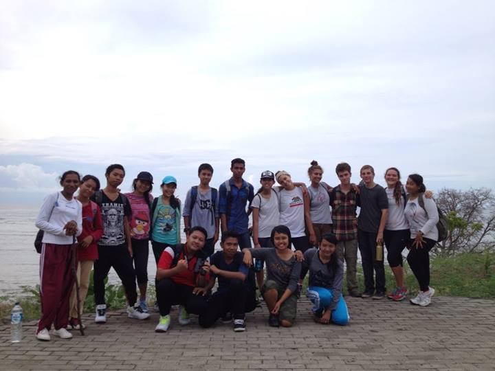
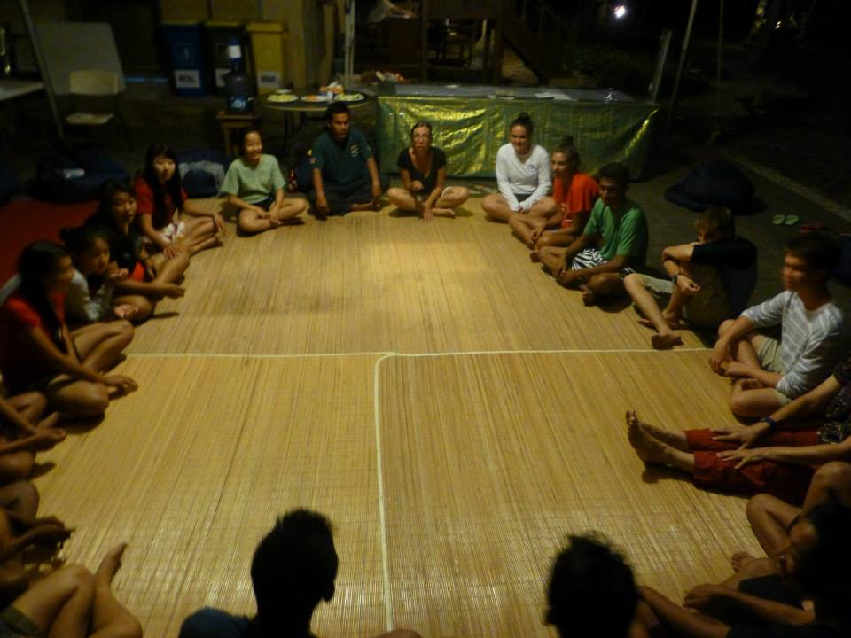

               *The stewards*

## INTRODUCTION:
The health of the environment has always been a large concern of mine. I like to try and do whatever I can to impact it positively. Through my friendship with Keiko Bonk, a local Green Party politician in Hawai'i, I was able to participate in the Biosphere Stewardship Scholarship project. This project involved community service and educational opportunities with other passionate students from around the globe. It is important to have projects like these to spread awareness and keep young people involved in these important topics. 

               *The council*

Aside from the scientific learning the actual experience was similar to [Survivor](https://en.wikipedia.org/wiki/Survivor_(American_TV_series)), a show I enjoyed watching growing up. Every so often we would have a council at night. Friendships and rivalries were developed between different groups of stewards. Physical labor was similar to the challenges on the show. I often thought that this is what the show would likely feel like if I was actually on the show. Also I want to mention that the snorkeling around Menjangan Island was one of the most stunning experiences I've ever had.

Overall it was a great experience.

Also I want to tie in a CS-related event that occured during this experience. It happened on the way back home, in the South Korean airport. I wanted to view some of the images I had captured in Bali. I plugged the SD card into a port in a public computer in the airport. I viewed my images and safely ejected the SD card. When I got home however, many of the images were corrupted. Was this a virus? What had happened? I am not sure, but it is something to keep in mind while traveling again.

***************************************************************************************

