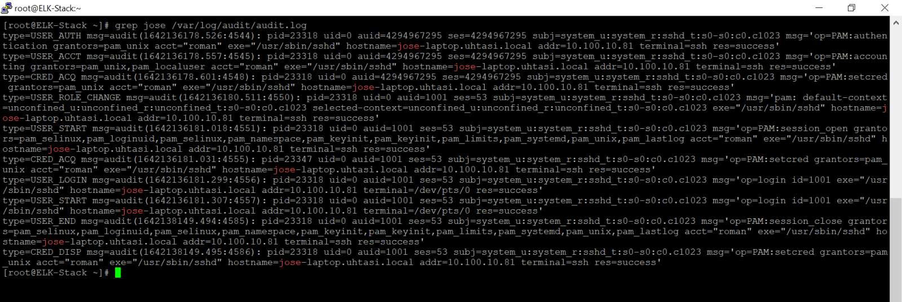

## Back-Story:

The above image is a screeshot from what I saw aft in to my work VM at TASI (check more on my experience with TASI here[]). I was initially worried that my password was known and used to sign in from Jose's workstation. Obviously, no one would ever want their password to be known by others so I asked my supervisor about this and he told me that it most likely was TASI's firewall DNS associating old IPs with hostnames. Thomas told me to dig a little deeper to confirm this. This post is my experience doing so.

## Check Audit Logs

The first step to take is to check the audit logs on the VM. Audit logs provide granular details in regards to what is going on on the system. In this case I did a simple grep command to isolate logs containing 'jose'. The login event was displayed on the screen and gave me further information. Most importantly, it displayed that the login from jose-laptop.uhtasi.local had an IP address of 10.100.10.81.

## Check the ELK-Stack:
This fun project taught me the power of certain coding techniques. The idea that there is a lot more to a project underneath the graphics code-wise was also enforced. It also gave me more experience with working through the different stages of development of a project: going from a simple idea to an actual working device/software/etc. I look forward to programming something similar in the future!

***************************************************************************************

*This project was developed in the [Eclipse IDE](https://www.eclipse.org/) and utilized the [EZ Graphics Library](http://www2.hawaii.edu/~dylank/ics111/) created by graduate student Dylan Kobayashi.*

<!--  -->
