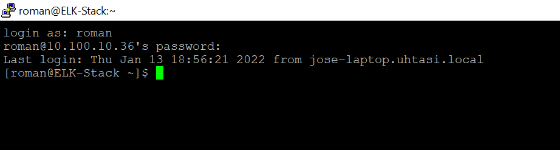

## INTRODUCTION:
The above image is a screeshot from what I saw after logging in to my work VM at TASI (check more on my experience with TASI here[]). I was initially worried that my password was known and used to sign in from Jose's workstation. Obviously, no one would ever want their password to be known by others so I asked my supervisor about this and he told me that it most likely was TASI's firewall DNS associating old IPs with hostnames. Thomas told me to dig a little deeper to confirm this. This post is my experience doing so.

## HOW DOES IT WORK?
The main coding framework behind this is known as the *finite state machine*. A finite state machine is a very simple, yet very effective coding techinque that is applicable in Computer Science as well as Engineering. Here, I designated the various "states" of my slot machine as the different logical steps one would take in interacting with the machine in real life. For example: starting the machine, spinning the rolls, obtaining coins, etc. Between the start and end states, nothing is static, and can be interchanged indefinitely until a user runs out of coins to play.

An "aha-moment" that I had when working on this project occured after the semester. When I submitted this project for grading, it actually was not implemented as a finite state machine. Instead, it was a messy entanglement of various objects and methods, that when put together, somehow managed to create a working slot machine. As you can imagine, coding this project was very frustrating and took a lot of trial-and-error.

After the semester had concluded, I revisted this project on my free time, and cconverted it to the finite state machine. It was beautiful how the code was now working in the same way, but also so smoothly and logically (and with much fewer lines of code). It was a breakthrough moment that made me appreciate the elegancy that code has the potential to achieve.

## CONCLUDING:
This fun project taught me the power of certain coding techniques. The idea that there is a lot more to a project underneath the graphics code-wise was also enforced. It also gave me more experience with working through the different stages of development of a project: going from a simple idea to an actual working device/software/etc. I look forward to programming something similar in the future!

***************************************************************************************

*This project was developed in the [Eclipse IDE](https://www.eclipse.org/) and utilized the [EZ Graphics Library](http://www2.hawaii.edu/~dylank/ics111/) created by graduate student Dylan Kobayashi.*

<!--  -->
