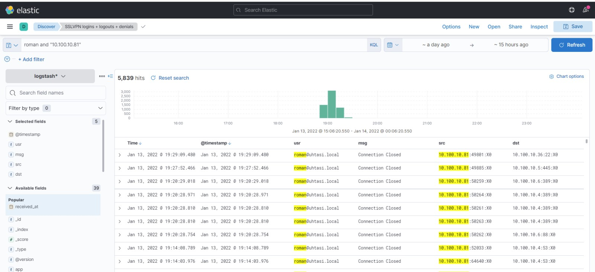

## Back-Story

The above image is a screeshot from what I saw after logging into my work VM at TASI (check more on my experience with TASI [here]({{ site.baseurl }}/projects/tasi)). I was initially worried that my password was known and used to sign in from Jose's workstation. Obviously, no one would ever want their password to be known by others so I asked my supervisor about this and he told me that it most likely was TASI's firewall DNS associating old IPs with hostnames. Thomas told me to dig a little deeper to confirm this. This post is my experience doing so.

## Check Audit Logs

The first step to take is to check the audit logs on the VM. Audit logs provide granular details in regards to what is going on on the system. In this case I did a simple `grep` command to isolate logs containing `jose`. The login event was displayed on the screen and gave me further information. Most importantly it displayed that the login from `jose-laptop.uhtasi.local` had an IP address of `10.100.10.81`.

## Check ELK-Stack

I decided to look in Kibana to see the login patterns of Jose and I. I found activity from Jose when he was assigned the `10.100.10.81` IP. 

I then wanted to see what IP I had been assigned. It turned out that I had been given the `10.100.10.81` IP as well. So it appears that Jose was assigned the `10.100.10.81` IP earlier on in the day before logging out and freeing the IP. I shortly logged in afterwards and received the same IP after it had been recycled back into the IP pool. It seems like there was an overlap in the firewall's DNS protocol of associating the `10.100.10.81` IP with the `jose-laptop.uhtasi.local` hostname vs my hostname. 

This is my process of trying to solve this issue using the IT tools available to a sys-admin. I still would like to investigate this issue further. Though I offered some evidence and explanation for what may have happened, I still was unable to prove my hypothesis definitively (I wish there was a way to look at the DNS associating the IP with the hostname by `timestamp`).
